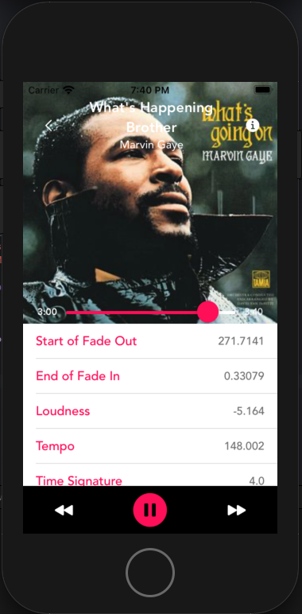

# AudioAnalysis

An iOS application where you can find out audio and music details of a particular song from Spotify's own API.

## Commands

Run this command to start the api from Go

```bash
go run main.go
```

## Screenshots
 &nbsp;


## Tech Stack
* Swift
* Go
* Objective-C


## Contributing
Pull requests are welcome. For major changes, please open an issue first to discuss what you would like to change.
